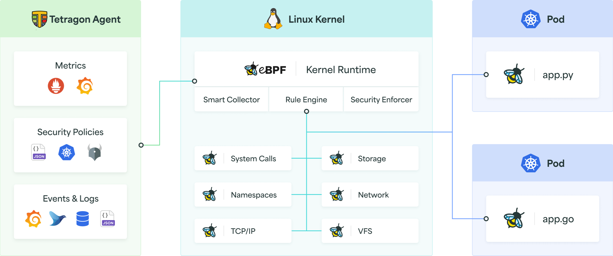
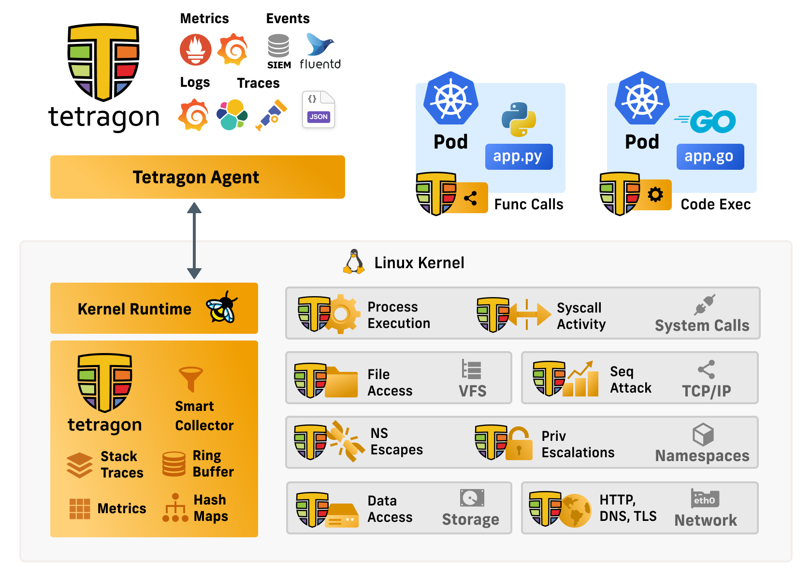
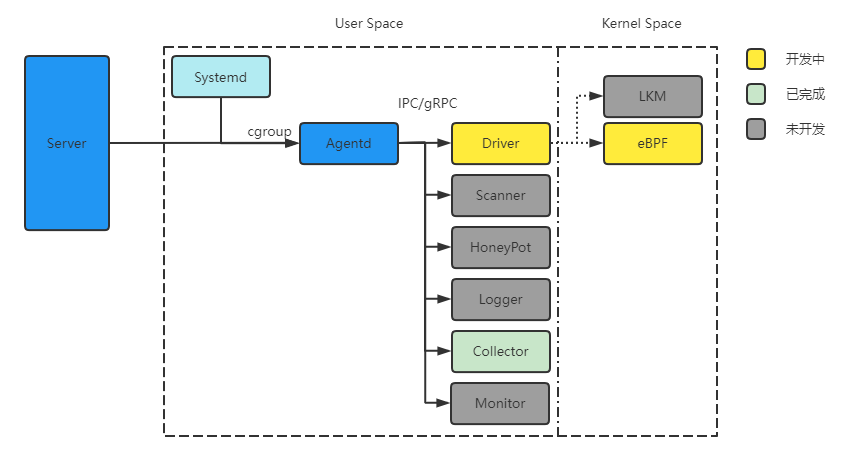
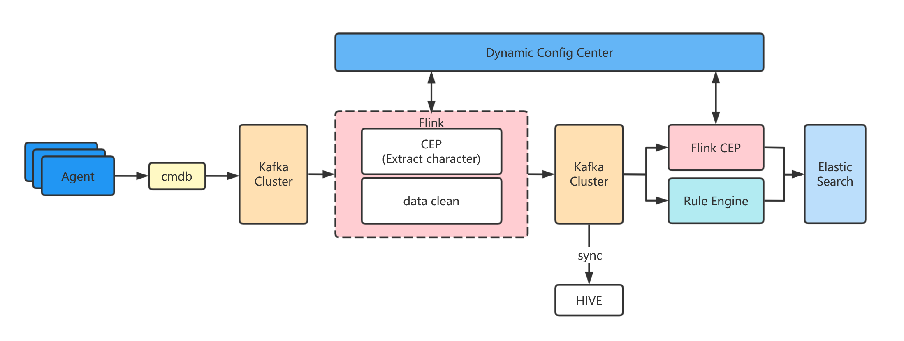

Linux 主机安全开源项目

- [1. 概述](#1-概述)
  - [1.1. 参考](#11-参考)
  - [1.2. 分析维度](#12-分析维度)
- [2. 开源 HIDS/EDR/CWPP](#2-开源-hidsedrcwpp)
  - [2.1. Tracee - Linux Runtime Security and Forensics using eBPF](#21-tracee---linux-runtime-security-and-forensics-using-ebpf)
    - [2.1.1. 事件](#211-事件)
  - [2.2. Elkeid - Bytedance Cloud Workload Protection Platform](#22-elkeid---bytedance-cloud-workload-protection-platform)
    - [2.2.1. 架构](#221-架构)
    - [2.2.2. 核心功能](#222-核心功能)
    - [2.2.3. 技术原理](#223-技术原理)
  - [2.3. OSSEC](#23-ossec)
    - [2.3.1. 架构](#231-架构)
    - [2.3.2. 核心业务](#232-核心业务)
  - [2.4. ehids-agent](#24-ehids-agent)
  - [2.5. Falco - Cloud Native Runtime Security](#25-falco---cloud-native-runtime-security)
  - [2.6. Tetragon - eBPF-based Security Observability and Runtime Enforcement](#26-tetragon---ebpf-based-security-observability-and-runtime-enforcement)
    - [2.6.1. 架构](#261-架构)
  - [2.7. Fail2Ban](#27-fail2ban)
  - [2.8. ThreatMapper - Runtime Threat Management and Attack Path Enumeration for Cloud Native](#28-threatmapper---runtime-threat-management-and-attack-path-enumeration-for-cloud-native)
  - [2.9. ZeusCloud - Open Source Cloud Security](#29-zeuscloud---open-source-cloud-security)
  - [2.10. 驭龙 HIDS](#210-驭龙-hids)
  - [2.11. Hades - eBPF based HIDS](#211-hades---ebpf-based-hids)
    - [2.11.1. 架构](#2111-架构)
    - [2.11.2. 核心功能](#2112-核心功能)
- [3. 非开源 HIDS/EDR/CWPP](#3-非开源-hidsedrcwpp)

## 1. 概述 

### 1.1. 参考

https://github.com/topics/hids

https://github.com/topics/cwpp

https://github.com/topics/edr

https://github.com/topics/linux-security

https://github.com/topics/antivirus

### 1.2. 分析维度

- 架构
- 核心业务
  - 数据模型
  - 事件模型
  - 分析
  - 告警/响应/处置
- 核心技术

## 2. 开源 HIDS/EDR/CWPP

### 2.1. Tracee - Linux Runtime Security and Forensics using eBPF

> Star: 3k  
> 
> URL: https://github.com/aquasecurity/tracee 
> 
> About: Tracee 是一款运行时安全和可观察性工具，可帮助您了解系统和应用程序的行为方式。它使用 eBPF 技术来接入系统，并将这些信息作为可以使用的事件。事件范围从实际系统活动事件到可检测可疑行为模式的复杂安全事件。  
> 
> Program：Go、C

#### 2.1.1. 事件

6种内置事件类别
- syscalls
- network
- security
- lsm
- containers
- misc

### 2.2. Elkeid - Bytedance Cloud Workload Protection Platform

> Star: 1.9k  
> 
> URL: https://github.com/bytedance/Elkeid/tree/main
>   
> About: Elkeid 是一款可以满足 主机，容器与容器集群，Serverless 等多种工作负载安全需求的开源解决方案，源于字节跳动内部最佳实践。  
> 
> Program：Go、C、Rust、C++

#### 2.2.1. 架构

- **Host Ability**
  - **Elkeid Agent** 用户态 Agent，负责管理各个端上能力组件并与 **Elkeid Agent Center** 通信
  - **Elkeid Driver** 负责 Linux Kernel 层采集数据，兼容容器，并能够检测常见 Rootkit
  - **Elkeid RASP** 支持 CPython、Golang、JVM、NodeJS、PHP 的运行时数据采集探针，支持动态注入到运行时
  - **Elkeid Agent Plugins**
    - **Driver Plugin**: 负责与 Elkeid Driver 通信，处理其传递的数据等
    - **Collector Plugin**: 负责端上的资产/关键信息采集工作，如用户，定时任务，包信息等
    - **Journal Watcher**: 负责监测systemd日志的插件，目前支持ssh相关日志采集与上报
    - **Scanner Plugin**: 负责在端上进行静态检测恶意文件的插件，支持 Yara
    - **RASP Plugin**: 分析系统进程运行时，上报运行时信息，处理下发的 Attach 指令，收集各个探针上报的数据
    - **Baseline Plugin**: 负责在端上进行基线风险识别的插件
- **Backend Ability**
  - **Elkeid AgentCenter** 负责与 Agent 进行通信并管理 Agent 如升级，配置修改，任务下发等
  - **Elkeid ServiceDiscovery** 后台中的各组件都会向该组件定时注册、同步服务信息，从而保证各组件相互可见，  便于直接通信
  - **Elkeid HUB** 策略引擎
  - **Elkeid Manager** 负责对整个后台进行管理，并提供相关的查询、管理接口
  - **Elkeid Console** Elkeid 前端部分

#### 2.2.2. 核心功能

**资产盘点**

> 统一管理主机列表、容器列表、进程、Java进程依赖信息、端口、账号、系统组件、系统服务、定时任务、系统完整性等资产指纹信息，帮助企业资产可视化

- 日志
  - 认证授权
    - /var/log/secure
    - /var/log/auth
  - /var/log/messages

**安全基线**

**入侵检测**

> 对主机与容器的入侵行为进行检测并提供处置方案，包括：反弹shell、本地提权、容器逃逸、后门木马、内核态后门、恶意命令、可疑命令序列、暴力破解等

**RASP**

> 对**系统进程运行时**和**应用运行时（JVM、PHP、Golang）**入侵行为进行实时检测并提供处置方案，包括：各类内存马、各类RCE、SSRF、ONGL注入、可疑命令序列等，且支持热补丁技术

#### 2.2.3. 技术原理

1. **内核层数据采集与 Rootkit 检测**

2. **端上资产/关键信息采集**

3. **日志采集**

- shenf

4. **基线检测**

- 身份鉴别-设置密码失效时间<=90天
  - 说明
    - 设置密码失效时间，定期修改密码策略，减少密码被泄漏和猜测风险，使用非密码登陆方式(如密钥对)请忽略此项。
  - 检测
    - 文件 `/etc/login.defs` 中 `PASS_MAX_DAYS <= 90`

- 身份鉴别-密码修改最短周期>=2天
  - 说明
    - 设置密码修改最小间隔时间，限制密码更改过于频繁
  - 检测
    - 文件 `/etc/login.defs` 中 `ASS_MIN_DAYS >= 2`

- 身份鉴别-密码到期时间警告>=7天
  - 说明
    - 确保密码到期警告天数为7或更多
  - 检测
    - 文件 `/etc/login.defs` 中 `PASS_WARN_AGE >= 7`

- 身份鉴别-密码复杂性检查
  - 说明
    - 检查密码长度和密码是否使用多种字符类型
  - 检测
    - 文件 `/etc/security/pwquality.conf` 中 `minlen >= 8`
    - 文件 `/etc/security/pwquality.conf` 中 `minclass >= 3`
    - 文件 `/etc/pam.d/password-auth` 和 `/etc/pam.d/system-auth`中`pam_pwquality.so`这一行的`try_first_pass`后边 `retry <= 3`

- 身份鉴别-确保root是唯一UID为0的用户
  - 说明
    - 除root以外其他UID为0的用户都应该删除，或者为其分配新的UID
  - 检测
    - cmd `cat /etc/passwd | awk -F: '($3 == 0) { print $1 }'|grep -v '^root$' )`，输出用户名

- 身份鉴别-查是否限制密码重用
  - 说明
    - 限制用户之间重用密码的行为，降低密码泄漏的风险
  - 检测
    - 文件`/etc/pam.d/password-auth`和`/etc/pam.d/system-auth`中`password sufficient pam_unix.so` 这行`remember=5`

- 身份鉴别-空口令账户检测
  - 查看`/etc/shadow`
  - `*`代表帐号被锁定,`!!`表示密码过期
  - 为空口令账户设置安全密码，或执行`passwd -l <username>`锁定用户

- SSH检测-SSH空密码检测
  - 文件`/etc/ssh/sshd_config`中配置`PermitEmptyPasswords no`

- SSH检测-SSH失败尝试次数<5
  - 说明
    - 设置较低的 MaxAuthTrimes 参数将降低 SSH 服务器被暴力攻击成功的风险
  - 检测
    - 文件`/etc/ssh/sshd_config`中配置`MaxAuthTries 5`

- SSH检测-减少空闲超时退出时间
  - 说明
    - 设置SSH空闲超时退出时间,可降低未授权用户访问其他用户ssh会话的风险
  - 检测
    - 文件`/etc/ssh/sshd_config`中
      - `ClientAliveInterval <= 900`(15分钟)
      - `ClientAliveCountMax`为`0-3`之间

- SH检测-确保SSH LogLevel设置为INFO
  - 说明
    - 确保SSH LogLevel设置为INFO,记录登录和注销活动
  - 检测
    - 文件`/etc/ssh/sshd_config`中`LogLevel INFO`

- 安全审计-确保开启日志守护进程(auditd)
  - check ：`systemctl is-enabled auditd`，output：`enabled`
  - 启动 auditd 服务: `systemctl --now enable auditd`

- 安全审计-确保开启日志守护进程(rsyslog)
  - check ：`systemctl is-enabled rsyslog`，output：`enabled`
  - 启动 rsyslog 服务: `systemctl --now enable rsyslog`

- 入侵防范-开启地址随机化(ASLR)
  - 说明
    - 将进程的内存空间地址随机化来增大入侵者预测目的地址难度，从而降低进程被成功入侵的风险
  - 检测 
    - cmd `grep -Rh ^kernel\.randomize_va_space /etc/sysctl.conf /etc/sysctl.d` 或 `sysctl kernel.randomize_va_space`， result `kernel.randomize_va_space = 2`
  - 解决
    - cmd `sysctl -w kernel.randomize_va_space=2`

- 文件权限-确保配置文件的安全性
  - 说明：
    - 为了保证系统的安全性，请确保配置文件的安全性和唯一性，限制未授权用户对配置文件的一切操作，包括访问、读写、删除等
  - 检测：
    - cmd `stat /etc/passwd |sed -n '4p'|grep  -Eo '[0-9]{4}'`，result `0644`
    - cmd `stat /etc/shadow |sed -n '4p'|grep  -Eo '[0-9]{4}'`，result `0400`
    - cmd `stat /etc/group |sed -n '4p'|grep  -Eo '[0-9]{4}'`，result `0644`
    - cmd `stat /etc/gshadow |sed -n '4p'|grep  -Eo '[0-9]{4}'`，result `0400`
  - 解决：
    - cmd `chown root:root /etc/passwd /etc/shadow /etc/group /etc/gshadow`
    - cmd `chmod 0644 /etc/group`
    - cmd `chmod 0644 /etc/passwd`
    - cmd `chmod 0400 /etc/shadow`
    - cmd `chmod 0400 /etc/gshadow`

- 文件权限-用户访问配置文件的权限
  - 检测
    - cmd `stat /etc/hosts.allow |sed -n '4p'|grep  -Eo '[0-9]{4}'`，result `0644`
    - cmd `stat /etc/hosts.deny |sed -n '4p'|grep  -Eo '[0-9]{4}'`，result `0644`
  - 解决：
    - cmd `chown root:root /etc/hosts.allow`
    - cmd `chown root:root /etc/hosts.deny`
    - cmd `chmod 644 /etc/hosts.allow`
    - cmd `chmod 644 /etc/hosts.deny`

1. **恶意文件检测（静态）**
ClamAV + Yara

1. **系统进程运行时防护**

2. **应用进程运行时防护**

### 2.3. OSSEC

> Star: 4.1k  
> URL: https://github.com/ossec/ossec-hids  
> About: OSSEC 是一个基于主机的开源入侵检测系统，可执行:日志分析、文件完整性检查、策略监控、rootkit 检测、实时警报和主动响应。它将 HIDS、日志监控和 SIM/SIEM 融合在一个简单、强大的开源解决方案中。 
> Program：C

#### 2.3.1. 架构

Manager（Server） + Agents/Agentless

#### 2.3.2. 核心业务

1. **基于日志的入侵检测**
   - /var/log/messages
   - /var/log/auth
   - /var/log/secure 

1. **rootkit 检测**
   - rootkit_files.txt 包含 rootkit 及其常用文件。对每个指定文件进行 stats、fopen 和 opendir 操作。因为某些内核级 rootkit 会在某些系统调用中隐藏文件。尝试这些系统调用越多，检测效果就越好。
   - rootkit_trojans.txt 包含被 rootkit 木马攻击的文件签名数据库。这种用木马版本修改二进制文件的技术通常被大多数流行的 rootkit 使用。这种检测方法不会发现任何内核级 rootkit 或任何未知 rootkit。
   - 扫描 /dev 目录，查找异常。/dev 目录中应该只有设备文件和 Makedev 脚本。很多 rootkit 会使用 /dev 隐藏文件。这种技术甚至可以检测到非公开的 rootkit。
   - 扫描整个文件系统，查找异常文件和权限问题。root拥有的文件如果有写入权限，则非常危险。此外，还将检查 Suid 文件、隐藏目录和文件。
   - 查找是否存在隐藏进程。使用 getsid() 和 kill() 来检查是否有 pid 被使用。如果 pid 被使用，但 "ps "看不到它，则表明存在内核级 rootkit 或木马版 "ps"。还要验证 kill 和 getsid 的输出是否相同。
   - 查找是否存在隐藏端口。使用 bind() 检查系统上的每个 tcp 和 udp 端口。如果无法绑定端口（端口正在被使用），但 netstat 没有显示该端口，则很可能安装了 rootkit。
   - 扫描系统上的所有接口，查找启用了 "promisc "模式的接口。如果接口处于混杂模式，"ifconfig "的输出应该会显示出来。如果不是，则可能安装了 rootkit。

3. **文件完整性监控（配置文件/Windows注册表）**
    攻击有多种类型，攻击载体也很多，但所有攻击都有一个共同点：它们都会留下痕迹，并总是以某种方式改变系统。从修改少量文件的病毒到改变内核的内核级 rootkit，系统的完整性总会发生一些变化。

    完整性检查是入侵检测的重要组成部分，它能检测出系统完整性的变化。OSSEC 通过查找系统中关键文件的 MD5/SHA1 校验和以及 Windows 注册表中的变化来实现这一点。

    其工作原理是，代理每隔几小时（用户自定义）扫描一次系统，并将所有校验和发送到服务器。服务器存储校验和，并查找对其进行的修改。如果有任何变化，就会发出警报。

### 2.4. ehids-agent

> Star: 345    
> URL: https://github.com/gojue/ehids-agent      
> About: 基于 eBPF 的 Linux 主机入侵检测系统     
> Program：C    

### 2.5. Falco - Cloud Native Runtime Security

> Star:     
> URL:      
> Program：  

**简介**
 

### 2.6. Tetragon - eBPF-based Security Observability and Runtime Enforcement

> Star: 2.9k    
> URL: https://github.com/cilium/tetragon     
> Program：Go、C  

- Tetragon 组件基于 **eBPF** 实现实时安全可观察性和运行时执行。
- Tetragon 可检测并应对安全重大事件，如：
  - **进程执行事件** 
  - **系统调用活动** 
  - **I/O 活动（网络和文件访问）** 
- Tetragon **具有 Kubernetes 感知能力**，即能够理解命名空间、pod 等 Kubernete 标识，可根据单个工作负载配置安全事件检测。

#### 2.6.1. 架构

  

  

### 2.7. Fail2Ban

> Star: 9.1k  
> URL: https://github.com/fail2ban/fail2ban 
> About: Daemon to ban hosts that cause multiple authentication errors（禁止导致多次身份验证错误的主机的守护进程）  
> Program：Python

### 2.8. ThreatMapper - Runtime Threat Management and Attack Path Enumeration for Cloud Native

> Star: 4.5k  
> URL: https://github.com/deepfence/ThreatMapper  
> About: Deepfence ThreatMapper 可在您的生产平台中搜索威胁，并根据其暴露风险对这些威胁进行排序。它能发现易受攻击的软件组件、暴露的秘密以及偏离良好安全实践的情况。ThreatMapper 结合使用基于代理的检测和无代理监控，以提供尽可能广泛的威胁检测覆盖范围。利用 ThreatMapper 的 ThreatGraph 可视化功能，可以确定对应用程序安全构成最大风险的问题，并将这些问题按优先顺序排列，以便进行有计划的保护或修复。  
> Program：TypeScript、Go

### 2.9. ZeusCloud - Open Source Cloud Security

> Star: 629 
> URL: https://github.com/Zeus-Labs/ZeusCloud 
> About:  
> Program：TypeScript、Go

### 2.10. 驭龙 HIDS

> Star: 2.1k  
> URL: https://github.com/ysrc/yulong-hids-archived 
> About: 驭龙HIDS是一款由 YSRC 开源的入侵检测系统，由 Agent， Daemon， Server 和 Web 四个部分组成，集异常检测、监控管理为一体，拥有异常行为发现、快速阻断、高级分析等功能，可从多个维度行为信息中发现入侵行为。 
> Program：Go

### 2.11. Hades - eBPF based HIDS

> Star: 260 
> URL: https://github.com/chriskaliX/Hades/tree/main  
> About: Hades 是一个基于 eBPF 的主机入侵检测系统，同时兼容低版本下通过 netlink(cn_proc) 进行事件审计，借鉴了Tracee和Elkeid 
> Program：C、Rust、Go

#### 2.11.1. 架构

**Agent**

  

**Data Analysis**

  

#### 2.11.2. 核心功能

1. **Linux Kernel Hook**

| Hook                                       | Status & Description                  | ID   |
| :----------------------------------------- | :------------------------------------ | :--- |
| tracepoint/syscalls/sys_enter_execve       | ON                                    | 700  |
| tracepoint/syscalls/sys_enter_execveat     | ON                                    | 698  |
| tracepoint/syscalls/sys_enter_memfd_create | ON                                    | 614  |
| tracepoint/syscalls/sys_enter_prctl        | ON(PR_SET_NAME & PR_SET_MM)           | 1020 |
| tracepoint/syscalls/sys_enter_ptrace       | ON(PTRACE_PEEKTEXT & PTRACE_POKEDATA) | 1021 |
| kprobe/security_socket_connect             | ON                                    | 1022 |
| kprobe/security_socket_bind                | ON                                    | 1024 |
| kprobe/commit_creds                        | ON                                    | 1011 |
| k(ret)probe/udp_recvmsg                    | ON(53/5353 for dns data)              | 1025 |
| kprobe/do_init_module                      | ON                                    | 1026 |
| kprobe/security_kernel_read_file           | ON                                    | 1027 |
| kprobe/security_inode_create               | ON                                    | 1028 |
| kprobe/security_sb_mount                   | ON                                    | 1029 |
| kprobe/call_usermodehelper                 | ON                                    | 1030 |
| kprobe/security_inode_rename               | ON                                    | 1031 |
| kprobe/security_inode_link                 | ON                                    | 1032 |
| uprobe/trigger_sct_scan                    | ON                                    | 1200 |
| uprobe/trigger_idt_scan                    | ON                                    | 1201 |
| kprobe/security_file_permission            | ON                                    | 1202 |
| uprobe/trigger_module_scan                 | ON                                    | 1203 |
| kprobe/security_bpf                        | ON                                    | 1204 |

2. **系统信息采集**

> S 代表异步采集，P 代表周期采集，C 代表触发采集

|   Event   | Type |  ID  |
| :-------: | :--: |  :-: |
| processes |  P   | 1001 |
|  crontab  |  P   | 2001 |
|sshdconfig |  P   | 3002 |
| ssh login |  S   | 3003 |
|   user    |  P   | 3004 |
| sshconfig |  P   | 3005 |
|    yum    |  P   | 3006 |
|host detect|  C   | 3007 |
|    apps   |  P   | 3008 |
|    kmod   |  P   | 3009 |
|    disk   |  P   | 3010 |
|  systemd  |  P   | 3011 |
| interface |  P   | 3012 |
|  iptable  |  P   | 3013 |
|bpf_program|  P   | 3014 |
|    jar    |  P   | 3015 |
|   dpkg    |  P   | 3016 |
|    rpm    |  P   | 3017 |
| container |  P   | 3018 |
|  socket   |  P   | 5001 |

## 3. 非开源 HIDS/EDR/CWPP